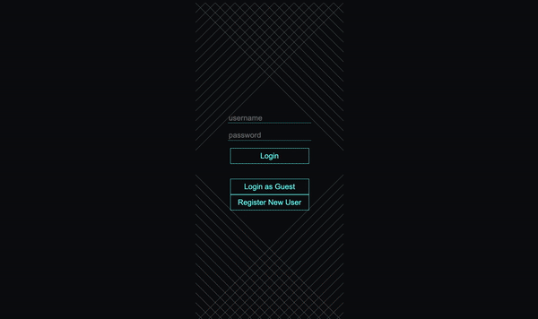
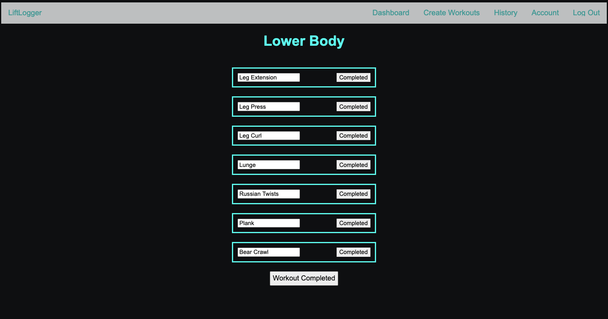
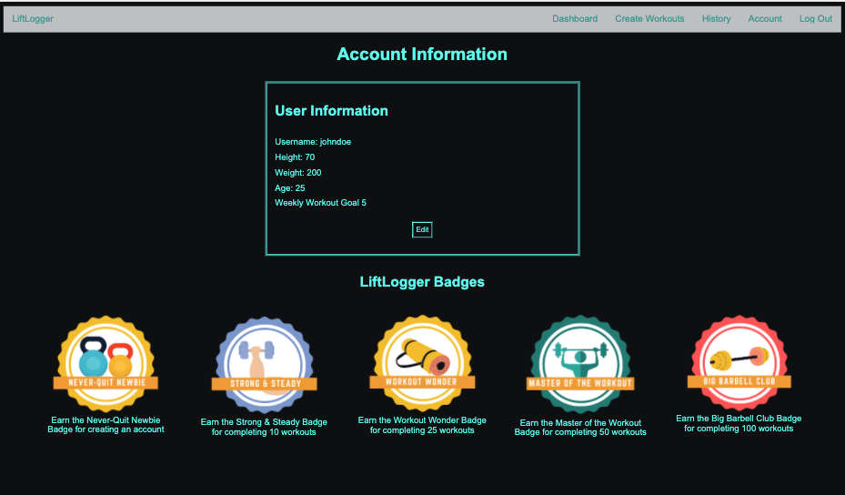

 

    

# 
<b>LiftLogger | Full Stack Web App</b>
LiftLogger was developed for workout enthusiasts and beginners alike. This app allows you to create custom workouts designed to target all body parts, as well as track and save your workout history. 

Created as a web app, the site is fully mobile responsive, making LiftLogger perfect for at-home workouts using your desktop or tablet, or at the gym, where you can easily access and track your workout on your phone.

View the live version of LiftLogger: https://dc-liftlogger.herokuapp.com/

<!-- TABLE OF CONTENTS -->
## Table of Contents

* [About the Project](#about-the-project)
  * [Built With](#built-with)
* [Videos And Screenshots](#videos-and-screenshots)
* [Getting Started](#getting-started)
  * [Installation](#installation)
* [Usage](#usage)
* [Team Members](#team-members)
* [Acknowledgements](#acknowledgements)

<!-- ABOUT THE PROJECT -->
## About The Project

LiftLogger was created by a three-member team as part of the DigitalCrafts Full-Stack Immersive Program. As fitness enthusiasts, we wanted to create an app that would provide users with a more efficient way of working out. 

Our personal goals for the project were as follows:

1. Personalize the experience for each user
* By requiring each user to create an account - passwords are salt hashed for security - we were able to provide users their personal workout stats and only display the custom workouts that they created.
* Users can adjust their weekly workout goals on their account page

2. Create a user experience that enhances a workout by providing value and ease of use
* To achieve this goal, we took a mobile-first approach to create a straightforward, user-friendly design, allowing users to easily create, find, and track their workouts whether at home or at the gym. 

3. Create an application that is welcoming and inclusive to everyone, from gym rats to those just starting their workout journey.
*  We tailored the workout routine creator to be appealing to both new and experienced exercisers by sorting specific exercises by the body parts that they target. 
* For those with a lot of experience, they can easily find the exercise and add it to their routine. 
* For newbies, this allows them to learn which moves target a specific body part and create a more effective routine. 

4. Allow users to create, view, update, and delete workouts, as needed
* Users can create as many workout routines as they would like. These are all available for view on the dashboard.
* To keep the dashboard from becoming too cluttered, users can delete workouts they no longer need. Their previously completed workouts will remain in their history, and they can re-do a workout from their history at any time
* Users can update their workouts on the fly, as they workout adding sets, reps, and weights to track their progress.

### Built With
LiftLogger was built and deployed as a full-stack web app using the following tools and technologies:

* JavaScript
* Node
* Express
* Express-Sessions
* Pg-Promise
* PostgresSQL
* ElephantSQL
* Mustache
* HTML
* CSS
* Bcrypt
* dotenv
* Heroku 

## Videos and Screenshots

### Log In Page:

### Dashboard:

### Workout Routine Creator:

### Workout Page:

### Account Page:

<!-- GETTING STARTED -->
## Creating Your Own LiftLogger
### Getting Started
You can use LiftLogger to create or modify your own fitness app, just fork our GitHub repository or clone it using the instructions below.

### Installation

1. Clone to local machine

git clone https://github.com/kjdonoghue/LiftLogger

2. Install NPM packages

    npm install bcryptjs 
    npm install dotenv 
    npm install express 
    npm install express-session 
    npm install mustache-express 
    npm install pg-promise 

3. Create a database

Use PostgresSQL or ElephantSQL to set up and connect to your own database.

<!-- CONTACT -->
## Team Members

Chapman Chappelle - (chapman.chappelle@gmail.com) - email (https://github.com/ChapmanChappelle) - github 
Kathryn Donoghue - (kathrynjdonoghue@gmail.com) - email (https://github.com/kjdonoghue) - github 
Dominic Waters - (dominicwaters12@gmail.com) - email   (https://github.com/DomWat) - github  

Project Link: [https://github.com/ChapmanChappelle/DigitalCrafts-BackEnd.git](https://github.com/github_username/repo_name)

<!-- ACKNOWLEDGEMENTS -->
## Acknowledgements
 - Kathryn Donoghue (https://github.com/kjdonoghue) - github
 - Chapman Chappelle (https://github.com/ChapmanChappelle) - github
 - Dominic Waters (https://github.com/DomWat) - github
  - Nathan Orris - **The Certified** - **DiR at DigitalCrafts Houston** -
    [NathanNoSudo](https://github.com/NathanNoSudo)

# <h2 align="center"> You are visitor # Thank you for stopping by!